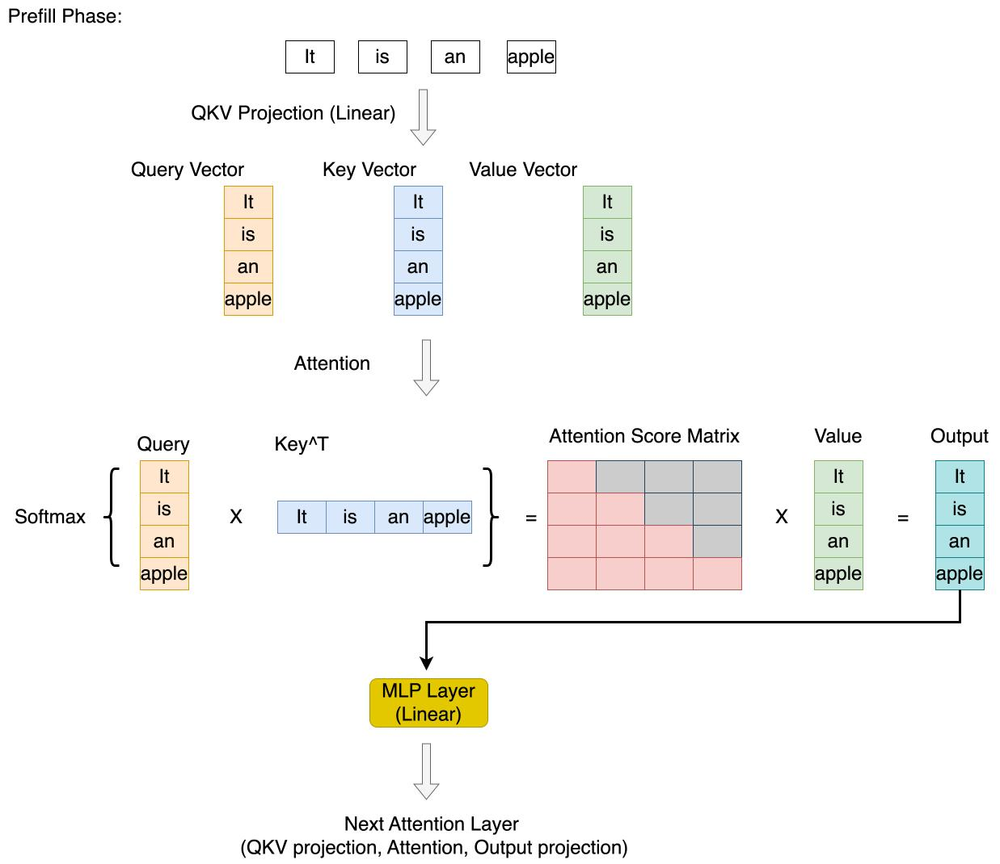
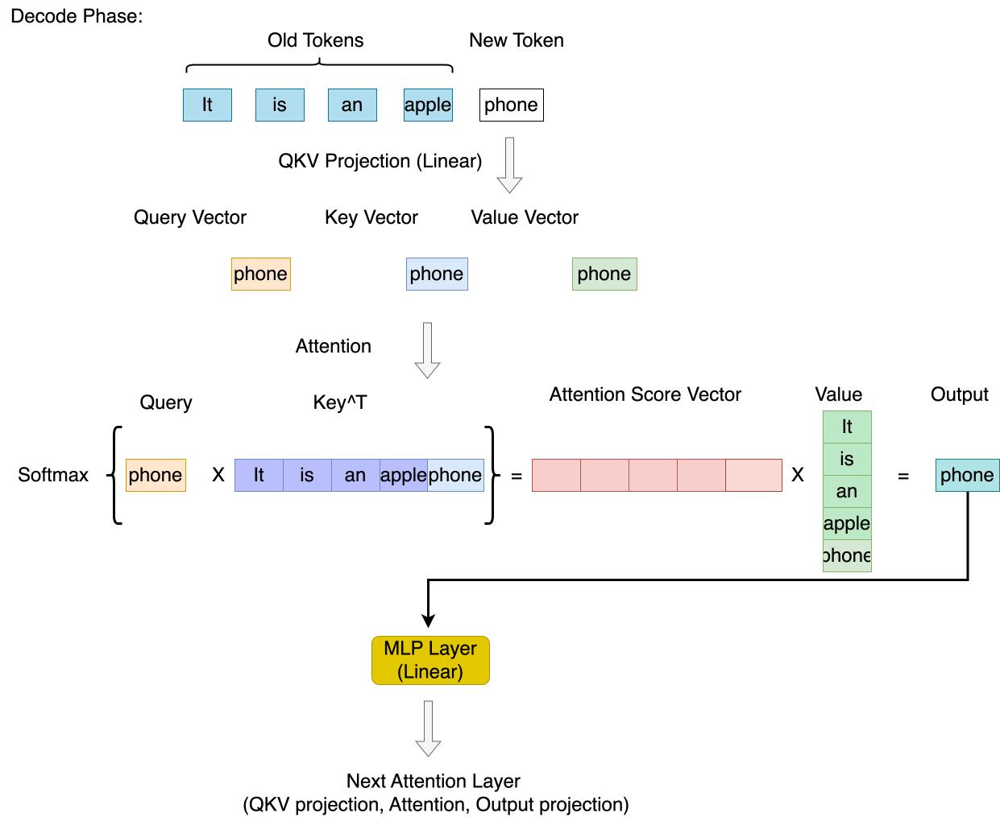
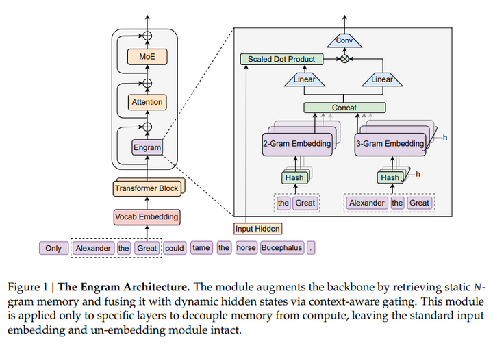
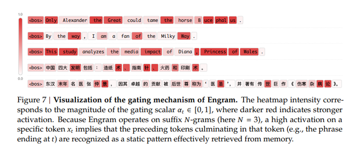

# 一、DeepSeek 4 要来了吗


DeepSeek 低调了一年，在 2026 年 1 月 12 日悄然更新了 GitHub。https://github.com/deepseek-ai/Engram

内容只有一篇论文和一个新模块的源码—— Engram。没有任何花里胡哨的东西，非常的“技术范”。

论文标题为：

> Conditional Memory via Scalable Lookup: A New Axis of Sparsity for Large Language Models

翻译过来是：大语言模型稀疏的新维度：通过可扩展查找实现的条件记忆。

这里有几个关键词，Sparsity 稀疏、Memory 记忆、Scalable Lookup 可扩展查找。


也许是大家觉得 DeepSeek 喜欢送新年礼物，这次的源码推出时间也是非常类似上次 V3 发布的时间，让大家觉得这像是 DeepSeek V4 的前瞻，憋个大的。

那么这个技术点够不够这个分量呢？这篇文章我们一起来分析下 DeepSeek 的这篇最新发表的论文在研究些什么，顺便给大家讲讲最近各大模型厂商在做什么。


# 二、当前大模型是如何运作的？

在讲这个新概念 Engram 前，先和大家回顾下当下大模型的运作模式：

目前的 LLM 普遍采用 Transformer 架构，只是不同模型会在此基础上做一些变种，比如 MOE ( 增加路由、专家等模式）、HOPE 范式等。但核心架构还是基本统一的。


大模型推理核心有两个阶段，Prefill 阶段和 Decode 阶段。

<p align="center">
  
</p>

<p align="center">
  
</p>

- Prefill 阶段

  核心任务：模型接收用户输入的 Prompt（提示词），并计算这些输入 Token 的中间状态（Key 和 Value 矩阵），为后续的生成做准备。


<details> 
<summary>内容举例</summary>
输入 Prompt：​谁是人类的常见的朋友

输入处理：模型把 ​谁是人类的常见的朋友 这句话里的每个字（Token）都转换成向量。

计算 KV：模型计算这 10 个字（假设分词后是 10 个 Token）对应的 Key (K) 和 Value (V) 向量。

K (Key)：代表这个字的“特征标签”（比如“朋友”这个词的 K 向量可能包含“名词、伙伴、关系”等特征信息）。

V (Value)：代表这个字的“内容实质”（用于最后加权求和的信息）。

存入 Cache：这 10 组 K 和 V 被存入显存，这就是初始的 KV Cache。

预测首字：模型利用这些信息，预测出了第一个字 —— 小。
</details>

- Decode 阶段

核心任务：基于 Prefill 阶段的信息和之前生成的所有 Token，逐个生成后续的 Token，直到遇到停止符（EOS）或达到最大长度限制。

<details> 
<summary>内容举例</summary>

现在模型手里拿着刚生成的  小 字，它想知道后面接什么。

1. 当前输入（Current Input）：

模型只接收  小 这一个字作为输入。

计算  小 的 Query (Q)、Key (K)、Value (V) 向量。

注意：此时显存里已经存了 Prompt 那 10 个字的 KV Cache。

2. 注意力计算（The "Search" Process）：

拿着 Q 找匹配：模型拿  小 的 Q 向量，去和 KV Cache 里存的那 10 个字的 K 向量，以及它自己的 K 向量进行点积运算。

结果：模型发现“小”和“朋友”、“常见”关联度很高（因为常见的朋友通常是小动物）。

3. 提取信息（Weighted Sum）：

根据刚才算出的关联度（注意力权重），模型从 KV Cache 的 V 向量中提取信息，并加上  小 自己的 V 向量。

这就融合了上下文信息：上下文(人类的朋友) + 当前字(小) = 下个字可能是某种小动物。

4. 预测与输出：

经过神经网络层处理计算，模型输出一个概率列表。如 狗 ( 70% ) 猫 ( 20% ) 。

基于温度等参数，选择概率最高的词是 狗。

5. 更新 Cache：

关键一步：把  小狗 这个字的 K 和 V 向量，追加写入到显存里的 KV Cache 中。

现在的 KV Cache 包含了：Prompt(10个字) + 小狗 的所有内容。
</details>


在训练和推理的其中各个路径上，目前各大团队都在探索优化手段。给各大团队的命题核心是提升模型效果。只有更牛的模型，才能吸引更多人的目光。

### 2.1 Scaling Law
而如何提升 LLM 的效果？ Scaling Law 被称为 AI 界的“摩尔定律”。

Scaling Law 是什么？

Scaling Law 是一个通用的概念，在数学、物理上都很常见。本义一个幂律分布。举个例子：圆的面积 r2 与半径的平方成正比； 球体的体积 r3半径的立方成正比，这就是幂律。

而在 AI 领域，是 OpenAI 首先提出的这个概念。OpenAI 是研究模型的性能（比如 Loss）到底跟模型的大小（N)、训练数据的多少(D)、还有耗费的算力(C) 是一个什么关系的时候发现的。

最终实验表明，模型的性能，最终的 Loss 跟模型的大小 N 是幂律分布，跟训练数据的多少(D) 是幂律分布，跟耗费的算力(C) 还是幂律分布。


基于此，目前各大模型公司仍然力大砖飞， Google Gemini 3 Pro 把能被扩展的维度——数据、模态、参数、训练时长、链式推理深度、搜索蒸馏一次性拉满。

于是整个行业第一次看到了一个横跨文本、图像、音频、视频、代码、数学、逻辑的统一模型，在全维度上同时爆发。

 截止 25 年底，Gemini 3 Pro 以庞大的数据量问鼎第一，现在全世界都在疯抢数据，导致现在内存条都疯狂涨价。
 
 当然，无穷大的数据并不一定导致效果一定好，谷歌作为搜索引擎，有更多且更优质的的训练数据，且 Gemini 3 Pro 的 HOPE 框架等也是取得成功的关键一环。

所以，除了堆数据外，在架构和机制上也有很多优化空间。这里引出来一个关键的优化方式 Sparsity。

### 2.2 Sparsity 稀疏

Sparsity 稀疏本身是智能系统的常见设计原则，从生物神经回路到现代 LLM 中都有应用。

在现代 LLM 中，Sparsity 是为了解决标准 Transformer 模型在处理长序列时计算复杂度过高而提出的一种优化机制。 而在 Transformer 的各个环节中可进行 Sparsity 优化的维度有多种。

从底层的硬件存储，到中间的模型架构，再到上层的推理策略，都是稀疏优化的方向：

这里以注意力稀疏 Attention Sparsity 这个维度来举例：

在标准的 Transformer 中，使用的是 全注意力（Full Self-Attention）机制，序列中的每一个 Token 都要和序列中其他所有的 Token 计算注意力分数。

代价：如果序列长度为  𝑁 ，那么计算量和内存消耗是  O( 𝑁2 )。

后果：当 𝑁 很大（例如处理整本书、长代码或长对话）时，显存会瞬间爆炸，计算速度极慢。这限制了模型处理长上下文（Long Context）的能力。


稀疏注意力通过限制每个 Token 的“视野”，将 𝑁 × 𝑁 的注意力矩阵变成一个稀疏矩阵。

稠密注意力（Dense）：Token A 关注 [B, C, D, E, F...] 所有词。

稀疏注意力（Sparse）：Token A 只关注 [B, C]（邻居）和 [F]（关键点），忽略其他。

这就 可能 将复杂度从 O( 𝑁2 ) 降低到了  O(𝑁log𝑁) 甚至 O(𝑁)。

当然但这也容易矫枉过正，过于稀疏会导致信息丢失，反向影响模型能力。


而 稀疏注意力 的优化方式也是各大大模型发挥独特性和能力特质不同的的核心点之一。

比如 DeepSeek 3.2 引入的 DSA (稀疏注意力)：引入了 Lightning Indexer，模型不扫描所有历史 Token，而是通过一个轻量级的索引器快速定位到“可能相关”的文本块（Block）。先在“块”的级别进行筛选（Coarse-grained），抛弃大量无关段落。再在选中的块内部进行“Token 级别”的精细选择（Fine-grained），只计算关键 Token 的注意力。


在各大探索的过程中，就引出了这次的主题 —— Engram 记忆痕迹， 也就是 Sparsity 的一个新维度。

# 三、Engram 记忆痕迹
### 3.1 介绍
一句话定义 Engram =  一个“现代版 𝑁‑gram 查表模块”，即用 O(1) 的代价，把局部、静态语言模式直接查出来，是一个和 MoE 平级的、结构性模块。


为什么需要 Engram ？ 这里有个大模型推理时的核心矛盾：计算 vs 检索

人类的做法：如果你问我“1234 乘以 5678 是多少”，我会去计算（推理）；但如果你问我“亚历山大大帝是谁”，我会直接从脑海里调取记忆（查表）。

Transformer / MoE 的做法：无论你问什么，它都在计算。

当模型输出“Alexander the Great”时，它并不是去数据库里读了一行字。

它是通过数千亿个参数，经过几十层的 Attention 和 FFN 的矩阵乘法，一层层地激活神经元，最后概率性地预测出下一个词应该是“Alexander”，再下一个是“the”，最后是“Great”。


那如何让 LLM 在运转过程中可以去直接查到数据呢？

而研究者参考了经典的 𝑁‑gram 结构的条件记忆模块。但配备了现代改进， 如 token-level N‑gram、multi-head hashing、gating 上下文门控和动态插拔相关能力，这些能力会在下文详细展开。


<details> 
<summary>什么是  𝑁‑gram ？</summary>
N‑gram = N 个连续 token 组成的片段用来预测下一个词或表示局部模式。

例如句子： “I love meituan ”

按不同 N：

1‑gram（unigram）

I / love / meituan

2‑gram（bigram）

I love / love meituan

3‑gram（trigram）

I love meituan


N‑gram 本质是一个“局部窗口模型”，只利用前 N−1 个词来预测第 N 个词。
</details>

<details> 
<summary>为什么参考  𝑁‑gram ？</summary>
因为自然语言里有大量固定、惯用、重复出现的局部模式：

固定搭配：“by the way”，“in order to”

专有名词：“United States of America”，“Alexander the Great”

中文固定结构： “有…有…也有…”，“四大发明包括…”

这些东西：非常局部，非常重复，非常稳定，适合“查表”。完全没必要用 Transformer 去算，而 N‑gram 就是用于捕捉这些静态局部规律的经典方法。

但因为各种各样的问题，比如上下文太大，字符识别问题等，N-gram 并没有被大规模利用起来。
</details>

### 3.2 实际运作模式

<p align="center">
  
</p>
如图所示，在训练时的计算前，多了一个步骤，就是 查，把查到的向量融合进来。相当于给 Transformer 内部装了一个“低成本、可扩展的查表层”。

但是加入这个查表层不是那么简单查完就给到数据就完事的，DeepSeek 设计了一套完整机制保障整体运转。

<b> 1. token-level  𝑁‑gram: Token 层级的规范化 </b>

𝑁‑gram 有较多的致命性缺陷，比如稍微不同的 token 就不归为同一个 𝑁‑gram，例如：

“Apple” vs “ apple” vs “APPLE”

传统 𝑁‑gram 根本不知道它们是同义。


而 Engram 从 token 维度做了规范，通过 Unicode NFKC、lowercasing、空格折叠、文本规范化、标准化字符映射等等，

可以实现

Apple → apple

APPLE → apple

Âpple → apple

aͤpple → apple

“ apple”、”\napple”、” apple” → apple

都转化为同义。

同时是基于 token 维度的，顺带也解决了多单词问题，比如“bad apple ” “bad applebad apple”，不管如何变幻，都形成统一的：2-gram = [“bad”, “apple”]。

<b> 2. 上下文感知 gating （ 门控系统 ）</b>

查出来的 embedding 是上下文无关的静态记忆这有两个风险：

哈希冲突、多义词

所以研究者做了一个注意力式门控系统：

门控输出定义为 v˜𝑡 = 𝛼𝑡 · v𝑡。这种设计强制执行语义对齐：如果检索到的记忆 e𝑡 与当前上下 文 h𝑡 相矛盾，门 𝛼𝑡 会趋向于零，从而有效抑制噪声。

这一步非常关键，它保证了 Engram 是“被上下文允许的记忆”，不是强行注入。

<p align="center">
  
</p>

图中颜色越深（越红） 表示 Engram 介入越强。可以看到在“术”、“针”等实体词语，激活明显更高。这在中文里非常重要，因为中文词边界弱、靠组合成义， 𝑁‑gram 对“稳定组合”的捕捉价值更高。


<b> 3. 残差注入（Residual connection）</b>

Engram 不替换模型的表示，只是额外给它加一点信息。


原本 Transformer 有自己的表示，Engram 提供“查表来的知识”。

最终结果就是：

“原模型表示 + 记忆信息”，

就像在做：“我让模型多看一眼记忆，但不干扰它的主路线。”


优势是，不破坏原模型能力，不需要重新训练所有层，且遇到错误信息时可以靠 gating 把 Engram 输出抑制掉。

所以残差 = 安全、稳定、不破坏性地加入新能力。


<b> 4. 独立插拔 </b>

Engram 不是像 attention 或 FFN 那样每一层都用，而是挑几层加。

加太多会浪费算力：Engram 查表在系统上涉及：hash 多次、查 embedding 表（GPU，甚至可能从 CPU prefetch）、gating，如果每层都加就太慢了。

语言的固定模式主要在“早期层”处理，这是论文中一个很重要的点：

Transformer 前几层通常做“局部模式识别”（例如拼 named entities），后面几层做“推理、逻辑、上下文汇总”。所以：在早期加 Engram → 最大收益（释放模型的基础负担）

在中期层再加一次，让 gating 更准早期层的 hidden state 信息少，gating 不够精准。在中层再加一次，就可以：用更多上下文且让模型更聪明地决定是否采用查表信息。

论文中的最终配置：30 层 Transformer，只在第 2 层 和 第 15 层加入 Engram

这样的优势就是：

前期替代基础 Pattern Matching

中期提供更强上下文交互

后期完全不干扰，用于推理


# 四、源码 DEMO 解析

工程中并没有提供实际源码，但提供了一个 Engram Demo，给上述各个模块给到了代码级解释。

我们可以管中窥豹，根据这些代码看下实现思路。

### 4.1 token-level  𝑁‑gram: Token 层级的规范化
- 功能: 在标准 Tokenizer (如 DeepSeek-V3) 的基础上，增加了一层映射，进行 Token 的规范化。

- 逻辑:

    1. 使用 normalizers 对 Token 进行清洗（去重音、转小写等）。

    2. 构建 lookup_table，将原始 Token ID 映射到一个更紧凑的 ID 空间 ( new_token_id )。这有助于减少稀疏性，聚焦于有效 Token。

```python
class CompressedTokenizer:
    def __init__(
        self,
        tokenizer_name_or_path,
    ):
        self.tokenizer = AutoTokenizer.from_pretrained(tokenizer_name_or_path, trust_remote_code=True)
        
        SENTINEL = "\uE000"
        self.normalizer = normalizers.Sequence([
            normalizers.NFKC(),
            normalizers.NFD(),
            normalizers.StripAccents(),
            normalizers.Lowercase(),
            normalizers.Replace(Regex(r"[ \t\r\n]+"), " "),
            normalizers.Replace(Regex(r"^ $"), SENTINEL),
            normalizers.Strip(),
            normalizers.Replace(SENTINEL, " "),
        ])
        
        self.lookup_table, self.num_new_token = self._build_lookup_table()
    
    def __len__(self):
        return self.num_new_token
    
    def _build_lookup_table(self):
        old2new = {}
        key2new = {}          
        new_tokens = []

        vocab_size = len(self.tokenizer)
        for tid in range(vocab_size):
            text = self.tokenizer.decode([tid], skip_special_tokens=False)
            
            if "�" in text:
                key = self.tokenizer.convert_ids_to_tokens(tid)
            else:
                norm = self.normalizer.normalize_str(text)
                key = norm if norm else text

            nid = key2new.get(key)
            if nid is None:
                nid = len(new_tokens)
                key2new[key] = nid
                new_tokens.append(key)
            old2new[tid] = nid
        
        lookup = np.empty(vocab_size, dtype=np.int64)
        for tid in range(vocab_size):
            lookup[tid] = old2new[tid]

        return lookup, len(new_tokens)
    
    def _compress(self, input_ids):
        arr = np.asarray(input_ids, dtype=np.int64)
        pos_mask = arr >= 0
        out = arr.copy()
        valid_ids = arr[pos_mask]
        out[pos_mask] = self.lookup_table[valid_ids]
        return out   
    
    def __call__(self, input_ids):
        return self._compress(input_ids)
       

```

4.2 𝑁‑gram 哈希映射

- 功能：是实现其 O(1) 极速显存访问的关键组件。它本质上是一个确定性的、多视角的索引生成器，负责将文本序列中的 𝑁‑gram 特征转化为显存表（Embedding Table）中的物理地址。以极低的内存代价（不需要存储巨大的 𝑁‑gram 字符串表）处理海量的 𝑁‑gram 组合，是其“外挂式”记忆能力的基础。

- 逻辑：

    1. 分词与 ID 化 (Tokenization)：CompressedTokenizer 会把要存储的文本切分成 Token 并映射为整数 ID。

    2. 构造 𝑁‑gram (Shift & Align)：代码通过 np.pad 和切片构造了 tokens， 存储了 𝑁‑gram 的整数 ID 内容。

    3. 哈希混合 (Mixing)：np.bitwise_xor 使用一组随机生成的奇数乘数 (Multipliers) 来混合这些 ID。

    4. 多头取模 (Multi-Head Modulo)：为了防止哈希冲突（比如另一个短语算出来也是 相同的哈希值），Engram 使用了多头 (Multi-Head) 机制。

- 举例：
<details> 
<summary>以 “四大名著之一是三国演义” 来举例</summary>
1. 分词与 ID 化 (Tokenization)

    首先，CompressedTokenizer 会把这句话切分成 Token 并映射为整数 ID。 为了方便计算，我们假设分词结果和对应的（压缩后）ID 如下：

    四大 名著 之一 是 三国 演义

    10 20    30  40  50  60

    位置(t) 0 1 2 3 4 5


2. 构造 𝑁‑gram (Shift & Align)

    当我们关注 t=3 (是) 这个时刻时，代码通过  np.pad 和切片构造了以下数据结构：

    tokens[0]： 整个序列本身。在 t=3 处是 60 ("是")。

    tokens[1] (向后移 1 位): 整个序列右移 1 格。在 t=3 处是 50 ("之一)。

    tokens[2] (向后移 2 位): 整个序列右移 2 格。在 t=3 处是 40 ("名著")。

    tokens[3] (向后移 3 位): 整个序列右移 3 格。在 t=3 处是 40 ("四大")。

    此时，在 t=3 这个位置，实现了一个纵向的切片： 4-gram ("四大 名著 之一 是")。

3. 哈希混合 (Mixing)

    代码使用一组随机生成的奇数乘数 (Multipliers) 来混合这些 ID。 假设当前层生成的乘数是：m = [111, 333, 555]。

    对于 t=5 处的 3-gram ("是 三国 演义")，哈希值的计算公式如下：

    Term_0 = 60 * 111 = 6660   (演义 * m0)
    Term_1 = 50 * 333 = 16650  (三国 * m1)
    Term_2 = 40 * 555 = 22200  (是   * m2)

    使用异或 (XOR) 进行混合
    Mix_Hash = 6660 ^ 16650 ^ 22200 
            = 28858 (假设值)

    这个 28858 就是 "是 三国 演义" 这个短语的原始哈希。

4. 多头取模 (Multi-Head Modulo)

    为了防止哈希冲突（比如另一个短语 "水浒 传 好看" 算出来也是 28858），Engram 使用了多头 (Multi-Head) 机制。

    假设我们有 2个头，代码动态寻找了两个质数作为模数（哈希表大小）：

    Head 1 模数: 10007

    Head 2 模数: 10009

    那么最终的索引计算如下：

    Head 1 Index: 28858 % 10007 = 8844

    Head 2 Index: 28858 % 10009 = 8840

5. 实际使用 / 后续查表 (Embedding Lookup)

    以 四大名著之一是 为例，假设现在已经识别到了 是 这个 token：

    - 识别 𝑁‑gram 

        在处理当前 Token “是” 的时候，Engram 会并行查看以“是”结尾的各种 N-gram 组合。Engram 模块会同时捕捉到以下信息（假设 max_ngram=4）：

        1-gram: [是]

        2-gram: [之一, 是]

        3-gram: [名著, 之一, 是]

        4-gram: [四大, 名著, 之一, 是]

    - 查表

        后续使用时，模型拿着这两个索引去 MultiHeadEmbedding 里查找向量：

        去 Head 1 区域 的第 8844 行取出一个向量 V1。

        去 Head 2 区域 的第 8840 行取出一个向量 V2。

        这两个向量 V1 和 V2 就代表了模型对 "四大 名著 之一 是" 这个 4-gram 的记忆。

    - 注入预测 (Injection)

        这个向量 V1 和 V2  被加到了当前 Token “是” 的隐藏状态中。

    - 最终预测 (Prediction)

        现在，主干网络（Transformer）在预测下一个词时，手头有两个信息源：

        原始语义理解: “这句话在讲文学常识...”（来自 Attention）。

        Engram 统计提示: “根据 四大名著之一是 这个 4-gram 的历史记录，下一个词通常是 三国、水浒 等等”（来自 向量 V1 和 V2 ）

        由于 Engram 的提示，模型的输出概率分布（Logits）中，“三国”、“水浒” 等词的概率会被按情况（ 门控系统 ）拔高。
</details>

```python
class NgramHashMapping:
    def __init__(
        self, 
        engram_vocab_size,
        max_ngram_size,
        n_embed_per_ngram,
        n_head_per_ngram,
        layer_ids,
        tokenizer_name_or_path,
        pad_id,
        seed,  
    ):
        self.vocab_size_per_ngram = engram_vocab_size
        self.max_ngram_size = max_ngram_size
        self.n_embed_per_ngram = n_embed_per_ngram
        self.n_head_per_ngram = n_head_per_ngram
        self.pad_id = pad_id
        self.layer_ids = layer_ids

        self.compressed_tokenizer = CompressedTokenizer(
            tokenizer_name_or_path=tokenizer_name_or_path
        )            
        self.tokenizer_vocab_size = len(self.compressed_tokenizer)
        if self.pad_id is not None:
            self.pad_id = int(self.compressed_tokenizer.lookup_table[self.pad_id])

        max_long = np.iinfo(np.int64).max
        M_max = int(max_long // self.tokenizer_vocab_size)
        half_bound = max(1, M_max // 2)
        PRIME_1 = 10007
        
        self.layer_multipliers = {}

        for layer_id in self.layer_ids:
            base_seed = int(seed + PRIME_1 * int(layer_id))
            g = np.random.default_rng(base_seed)
            r = g.integers(
                low=0,
                high=half_bound,
                size=(self.max_ngram_size,),
                dtype=np.int64
            )
            multipliers = r * 2 + 1
            self.layer_multipliers[layer_id] = multipliers

        self.vocab_size_across_layers = self.calculate_vocab_size_across_layers()

    def calculate_vocab_size_across_layers(self):
        seen_primes = set()
        vocab_size_across_layers = {}
        
        for layer_id in self.layer_ids:
            all_ngram_vocab_sizes = []
            for ngram in range(2, self.max_ngram_size + 1):
                current_ngram_heads_sizes = []
                
                vocab_size = self.vocab_size_per_ngram[ngram - 2]
                num_head = self.n_head_per_ngram
                current_prime_search_start = vocab_size - 1
                
                for _ in range(num_head):
                    found_prime = find_next_prime(
                        current_prime_search_start, 
                        seen_primes
                    )
                    seen_primes.add(found_prime)
                    current_ngram_heads_sizes.append(found_prime)
                    current_prime_search_start = found_prime
                
                all_ngram_vocab_sizes.append(current_ngram_heads_sizes)
            vocab_size_across_layers[layer_id] = all_ngram_vocab_sizes
            
        return vocab_size_across_layers

    def _get_ngram_hashes(
        self,
        input_ids: np.ndarray,
        layer_id: int,
    ) -> np.ndarray:
        x = np.asarray(input_ids, dtype=np.int64)
        B, T = x.shape

        multipliers = self.layer_multipliers[layer_id]

        def shift_k(k: int) -> np.ndarray:
            if k == 0: return x
            shifted = np.pad(x, ((0, 0), (k, 0)),
                                mode='constant', constant_values=self.pad_id)[:, :T]
            return shifted

        base_shifts = [shift_k(k) for k in range(self.max_ngram_size)]

        all_hashes = []
        
        for n in range(2, self.max_ngram_size + 1):
            n_gram_index = n - 2
            tokens = base_shifts[:n]
            mix = (tokens[0] * multipliers[0])
            for k in range(1, n):
                mix = np.bitwise_xor(mix, tokens[k] * multipliers[k])
            num_heads_for_this_ngram = self.n_head_per_ngram
            head_vocab_sizes = self.vocab_size_across_layers[layer_id][n_gram_index]
            
            for j in range(num_heads_for_this_ngram):
                mod = int(head_vocab_sizes[j])
                head_hash = mix % mod
                all_hashes.append(head_hash.astype(np.int64, copy=False))
        
        return np.stack(all_hashes, axis=2)

    def hash(self, input_ids):
        input_ids = self.compressed_tokenizer(input_ids)
        hash_ids_for_all_layers = {}
        for layer_id in self.layer_ids:
            hash_ids_for_all_layers[layer_id] = self._get_ngram_hashes(input_ids, layer_id=layer_id)
        return hash_ids_for_all_layers


```


### 4.3  TransformerBlock 残差连接

功能：模拟一个 Transformer 层，实例化并调用 Engram 模块，Engram 的输出以残差连接的方式加到 hidden_states 上。这里核心展示了 Engram 的接入方式。

```
class TransformerBlock(nn.Module):
    def __init__(self,layer_id):
        super().__init__()
        self.attn = lambda x:x
        self.moe  = lambda x:x
        self.engram = None
        if layer_id in engram_cfg.layer_ids:
            self.engram = Engram(layer_id=layer_id)
    
    def forward(self,input_ids,hidden_states):
        if self.engram is not None:
            hidden_states = self.engram(hidden_states=hidden_states,input_ids=input_ids) + hidden_states
        hidden_states = self.attn(hidden_states) + hidden_states
        hidden_states = self.moe(hidden_states) + hidden_states
        return hidden_states
```

# 五、最后

在 Reddit、X 等社区里，技术讨论的焦点并不在“效果提升了多少”，而在几个更底层的点上：

第一，确定性寻址

哈希 + 查表意味着：逻辑清晰、行为稳定、可预测，这对工程系统来说，价值极高。

第二，潜在的硬件友好性

Engram 的查找表，理论上可以放在主机内存中，而不是全部压在 GPU 上，硬件上的可能性会更高。

第三，它本身并不依赖新奇技巧

N-gram、哈希、查表，这些都是 NLP 领域的常客。但 DeepSeek 做的，是把它们重新放回现代 LLM 架构的正确位置。

比如这种对一个基础的 N-gram 进行了优化新思路，对整个 LLM 发展是有助益的。


DeepSeek 并没有说 Engram 会直接进入 V4。但它的特性让人觉得 V4 会用上：

这是一个可独立插拔的模块

它解决的是长期存在的结构性问题

论文中大量讨论的是规模化行为，而非小模型技巧

更重要的是，这种设计理念，和 DeepSeek 过去的路线高度一致：不盲目堆参数，而是不断重构 “算力应该花在哪里”。

# 六、参考资料
Engram Code / Paper

https://github.com/deepseek-ai/Engram, https://www.arxiv.org/pdf/2601.07372​​

Transformer

https://arxiv.org/abs/1706.03762,https://transformers.run/c1/transformer/

HOPE

https://arxiv.org/abs/2512.24695

Scaling Law

https://hub.baai.ac.cn/view/43071